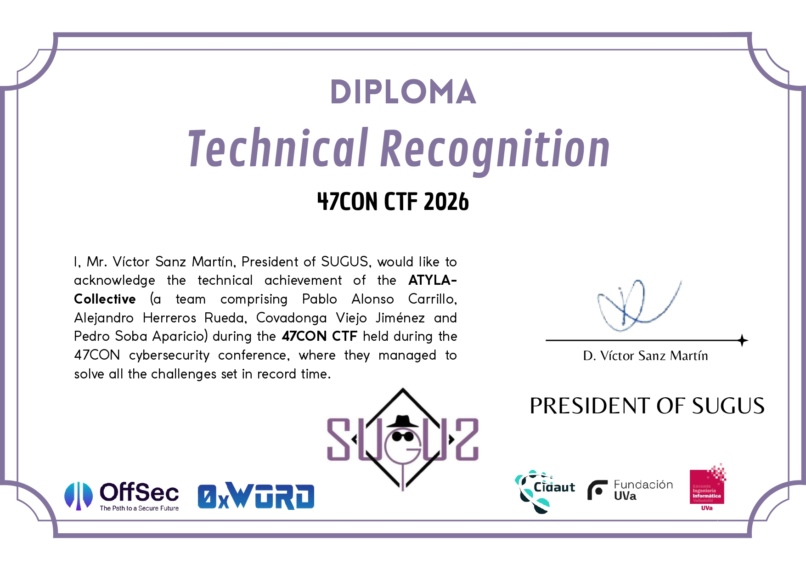

# 47CON CTF 2026 | Technical Operations Report

  
  

## 📝 Executive Summary
During the **47CON CTF (April 17-18, 2026)**, the **ATYLA Collective** successfully compromised the entire target infrastructure. The team resolved all proposed challenges across multiple offensive disciplines, concluding the operation with a total score of **7600 points**.

## 🛡️ Task Force: Operation 47CON
This operation was executed by the following squad:
* **Pablo Alonso Carrillo**
* **Alejandro Herreros Rueda**
* **Covadonga Viejo Jiménez** (Guest Operator)
* **Pedro Soba Aparicio** (Guest Operator)

---

## 🏆 Official Technical Recognition
The 100% resolution of the CTF environment was officially validated by the organizing entity, **Asociación SUGUS**.

  

---

## 🎯 Featured Technical Write-ups
The following directories contain the technical documentation and exploitation logic for the selected challenges:

| Challenge | Category | Documentation |
| :--- | :--- | :--- |
| **Pickle Rick** | Misc / Web | [View Write-up](./Pickle_Rick) |
| **[None]** | Cryptography | *Pending Publication* |
