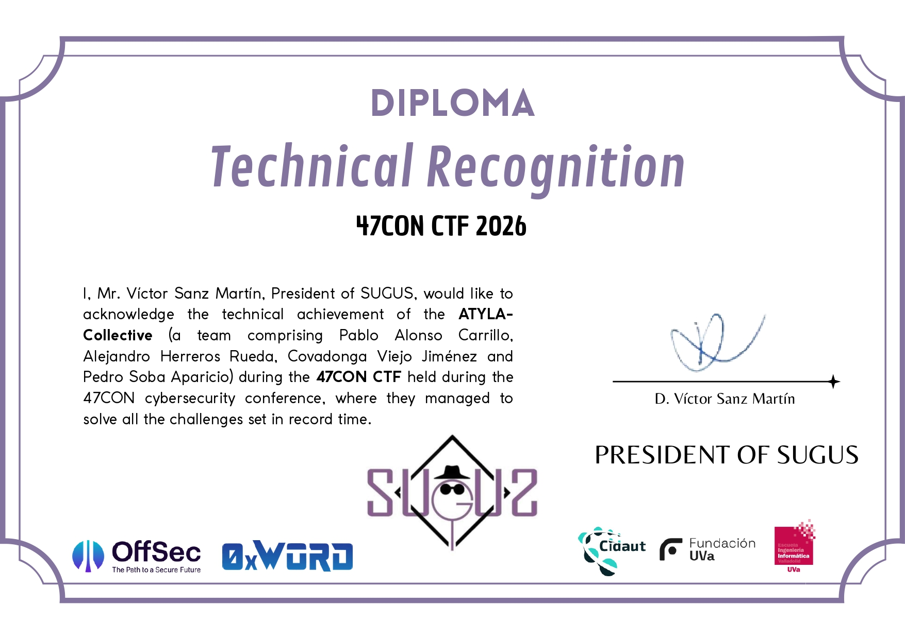

# 47CON CTF 2026 | Technical Operations Report

  
  

## 📝 Executive Summary
During the **47CON CTF (April 17-18, 2026)**, the **ATYLA Collective** successfully compromised the entire target infrastructure. The team resolved all proposed challenges across multiple offensive disciplines, concluding with a total score of **7600 points**.

## 👥 Team:

* **Pablo Alonso Carrillo**
* **Alejandro Herreros Rueda**
* **Covadonga Viejo Jiménez** (Guest)
* **Pedro Soba Aparicio** (Guest)

---

## 🏆 Technical Recognition
The 100% resolution of the CTF environment was validated by the organizing entity, **Asociación SUGUS**.

  

---

## 🎯 Featured Technical Write-ups
The following directories contain the technical documentation and exploitation logic for the selected challenges:

| Challenge | Category | Documentation | Author
| :--- | :--- | :--- | :--- |
| Pickle Rick | Misc / Web | [Writeup](../writeups/pickle_rick_writeup.pdf) | Alejandro Herreros |
| None | Cryptography | [Writeup](../writeups/None/) | Pablo Alonso |
